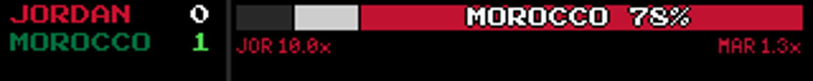
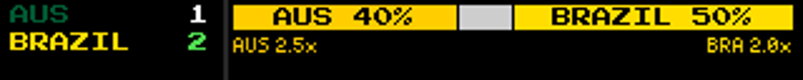

# Test Log — Bar-label outline + full WC country names (2026-06-19)

Branch `feature/soccer-worldcup-game-mode` · commits `7a475f4e`..`b4415678` (foundation `d092384f`).
Spec: `docs/superpowers/specs/2026-06-19-bar-label-outline-design.md` · Plan: `docs/superpowers/plans/2026-06-19-bar-label-outline-and-wc-names.md`.
Verified on the direct renderer. **Pi deploy is Eric's** (Python-only → hard `systemctl restart ledmatrix.service`).

## Part A — outline on Kalshi-bar % labels

**Status: SHIPPED, pixel-verified.**
Root cause: bar % labels use `contrasting_text_color` (correct white/black pick), but white on a mid-saturation fill (MAR red `(193,18,49)`) is only 6.18:1 — clears AA, fails AAA, and the chunky 8px white font blooms on the LED. `_draw_bar_label` now haloes **light** labels (`sum(fill) >= 384`) with a 1px black cross; dark/branded/grey-TIE labels draw unchanged.

## Part B — full World Cup country names (≤8 ASCII chars, UPPERCASED, space-permitting)

**Status: SHIPPED, pixel-verified.**
ESPN scoreboard already carries the full name (`displayName`/`name`); the soccer plugin now extracts `home_name`/`away_name`. `wc_display_name()` returns the full country name **uppercased** (Eric: "nah caps" → matches the abbrevs/scores) when league is `fifa.world` AND `len<=8` AND `.isascii()`, else the abbrev. Used in the scorebug + both bars, each with a pixel-fit fallback to the abbrev.

### Evidence

- Scorebug: **JORDAN / MOROCCO** (both ≤8 ASCII → full, uppercased). Bar: **MOROCCO 78%** white + black halo, legible on the red segment (vs the original soft "MAR 78%").


- **Australia (9 > 8) → AUS** abbrev (scorebug + bar); **Brazil (6) → BRAZIL** full. Both bar labels are **black on gold/yellow → NO halo** (correctly not over-treated — black-on-light is already crisp).
- `wc_display_name` unit table also covers **United States (13) → USA** and **Türkiye → TUR** (non-ASCII `ü`), and non-WC league → abbrev.

### Compose (A∘B)
The chosen label string (full name or abbrev) is drawn through `_draw_bar_label`, so "MOROCCO 78%" is both full-named and haloed. Confirmed in the Morocco frame.

## Tests
- `test/game_mode/test_bar_label_outline.py` — 6 passed: halo gate (white→halo / black→no-halo via two-image compare), `_full_name` extraction, `wc_display_name` rule table (incl. uppercase, Australia/USA/Türkiye/non-WC/empty), wide-segment full-name-reaches-bar.
- Regression: `test_three_way_bar` + `test_team_colors` + `test_possession` — 25 passed.
- **Zero regression:** HEAD full-suite = **611 passed / 7 failed / 22 errors** — the 7-failed/22-error set is the same known pre-existing set carried all session (test_remote_route_contains_zones, TestDottedKeyNormalization, etc.), +6 passing = the new tests. (The full foundation-vs-HEAD `comm` diff was interrupted/skipped at Eric's request; per-task regression checks + the matching HEAD failure set establish no new failures.)
- Final whole-feature review (opus) traced the name flow across all 5 hops on disk, confirmed A∘B compose, halo gate, isolation, and ran an explicit **no-crash audit** (every segment width is `max(1,...)`-clamped; `wc_display_name` short-circuits on empty name; `_draw_bar_label` does no width math) — the zero-width-rect class that bit the possession feature is not present.

## Not proven (honest)
- Live in-play focus on hardware (no webui `game_focus` in dev — `plugin_manifests` empty; pixel-verified via direct `GameModeRenderer`).
- The `get_game_focus_data` name plumbing is source-pinned + emulator-covered, not a behavioral unit test (manager not cheaply constructible) — opus traced it cold and confirmed correct.
- The caps follow-up (`.upper()`) landed after the opus final review; it's a trivial one-liner, tests-green and re-rendered.
- Note: the payout row (e.g. "JOR 10.0x") still shows abbrevs (out of scope — that row was never part of this change).

## Reproduction
```
EMULATOR=true python -m pytest test/game_mode/test_bar_label_outline.py -o addopts="" -v   # 6 passed
# pixel proof: .git/sdd/verify_p3.py  (Morocco halo frame + Australia/Brazil frame)
```

## Deploy (Eric's hands)
Python-only (soccer plugin + game-mode renderer) → `git pull` + `sudo systemctl restart ledmatrix.service`. No web restart. The bar/scorebug names + halo show on any focused soccer game; full names appear for ≤8-char ASCII countries that fit.
