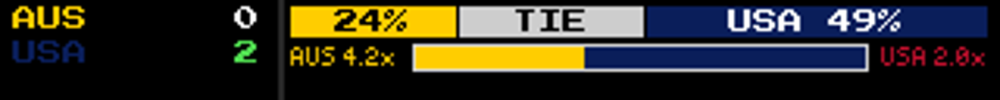

# Test Log — Soccer Possession Bar (2026-06-19)

Branch `feature/soccer-worldcup-game-mode` · commits `f951c9f1`..`17afaa09` (foundation `d931b44c`).
Spec: `docs/superpowers/specs/2026-06-19-soccer-possession-bar-design.md` · Plan: `docs/superpowers/plans/2026-06-19-soccer-possession-bar.md`.
Verified on the Windows emulator / direct renderer. **Pi deploy is Eric's** (Python-only → hard `systemctl restart ledmatrix.service`).

## Symptom — show ball possession by team on the focused soccer panel

**Status: SHIPPED to branch, emulator pixel-verified, zero regression.**

### What shipped
- The soccer plugin extracts per-team `possessionPct` from the ESPN scoreboard it **already fetches** (`_possession_pct` + `home_possession`/`away_possession` on the game `details` dict, `sports.py`), carried into `get_game_focus_data`'s `focus_data` (`manager.py`).
- `GameModeRenderer._render_odds_panel` draws a 2-segment possession bar (away-gold | home-navy) in the empty gap of the payout row between the two payout labels, light outline, no numbers — independent of Kalshi, gated on possession sum > 0 (`renderer.py`).

### Evidence
- **Data is real & free:** live ESPN `fifa.world` scoreboard confirmed `possessionPct` per team — USA 62 / AUS 38 (sums to 100). No new endpoint.
- **Pixel proof (real renderer):**  — rendered by the actual `_render_possession_bar` (not a hand mock) with `home_possession=62/away=38`. Bar sits in the payout-row gap, AUS-gold left / **USA-navy right** (raw brand color, NOT the payout label's red), white outline; Kalshi 3-way bar + "AUS 4.2x"/"USA 2.0x" payouts intact around it. Matches Eric's approved mockup.
- **Crash bug found & fixed:** the degenerate-split test exposed a real render crash — a 0/100 possession split made `aw=0` → away rect `[x0, y, x0-1, y+h]` (negative width) → PIL `ValueError`, crashing the game-focus render. Fixed by clamping `aw` to `[0, bar_w]` and skipping zero-width segments (`17afaa09`). The `(home+away)>0` gate already hides the 0/0 pre-match case. Real renderer re-rendered a 100/0 frame with no crash (full navy).
- **Tests:** `test/game_mode/test_possession.py` 8 passed (`_possession_pct` parse/missing; bar drawn/hidden/raw-navy; both degenerate splits). Regression `test_three_way_bar` + `test_team_colors` 17 passed.
- **Zero regression:** full suite at foundation `d931b44c` (7 failed / 597 passed / 22 errors) vs HEAD (7 failed / **605** passed / 22 errors) → identical failure set (`comm -23` empty), +8 passing = the new tests.

### Not proven (honest)
- **End-to-end chain not exercised in one run.** Two halves are each tested but not wired together in verification: the extraction half (`possessionPct → _possession_pct → details`) by the `_possession_pct` unit test; the render half (`focus_data → bar`) by the real-renderer pixel test with synthetic `focus_data`. The plugin→`focus_data` plumbing is source-pinned only (the `SoccerScoreboard` manager isn't cheaply constructible). The **full chain** (ESPN → bar) is first exercised when Eric focuses a **live soccer match** on the Pi after deploy.
- **Dev on-demand focus blocked:** the dev webui's `plugin_manifests` is empty, so `/display/on-demand/start` 404s "Plugin … not found" (pre-existing, documented). That's why the pixel proof is a direct `GameModeRenderer` call, not a webui-driven focus.
- Soccer possession refreshes at the live-manager poll cadence (~30–60s), so near-live, not real-time.

## Reproduction
```
# unit/renderer tests:
EMULATOR=true python -m pytest test/game_mode/test_possession.py -o addopts="" -v   # 8 passed
# pixel proof (real renderer): .git/sdd/verify_possession_real.py  (synthetic 62/38 + degenerate 100/0)
# live data check: curl -s https://site.api.espn.com/apis/site/v2/sports/soccer/fifa.world/scoreboard | grep -o possessionPct
```

## Deploy (Eric's hands)
Python-only (soccer plugin + game-mode renderer) → `git pull` + `sudo systemctl restart ledmatrix.service`. No web restart needed. After deploy, focus a live soccer match to see the possession bar populate (the end-to-end chain's first live exercise).
