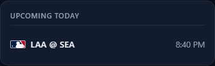

# Test Log — Upcoming Games Cell (2026-06-29)

**Branch:** `feature/upcoming-games-cell` (base `27fe8c68`)
**Plan:** `docs/superpowers/plans/2026-06-29-upcoming-games-cell.md`
**Spec:** `docs/superpowers/specs/2026-06-29-upcoming-games-cell-design.md`

Adds a display-only "Upcoming Today" cell listing today's scheduled (pre-state)
games across every sport plugin, with cross-sport representation, capped at 8.

## Per-surface status

### Phone remote `/v3/remote` — ✅ VERIFIED (primary surface)

Pixel proof captured from the dev web UI against a live emulator, real ESPN data:



- New `#upcoming-games` section renders directly below `#live-games`, matching the
  broadcast-dark `--rmt-*` styling.
- Real data at capture time: `LAA @ SEA · 8:40 PM` (MLB), with the MLB league logo
  via `leagueLogo()`. Display-only — no buttons/handlers.
- `renderUpcoming(data)` is invoked from all three exit paths of `refreshLiveGames()`
  (early-return, success, catch), so the cell never sticks on "Loading…".
- Empty state → "No more games today."; `+N more` line when the list exceeds 8.

DOM text scraped during the run (`#upcoming-games-content`):
```
LAA @ SEA
8:40 PM
```

### Desktop dashboard card (`games.html`) — ⚠️ implemented, surface dormant

- The Task 7 `games.html` edit is correct and committed, BUT the desktop dashboard's
  "Games" tab is **pre-existing dead/WIP**: `base.html:985` does
  `hx-get="/v3/partials/games"`, and `pages_v3.load_partial()` has **no `games` case**,
  so `GET /v3/partials/games` returns **404** and the tab sits on its skeleton loader.
- Both `games.html` and that dead `hx-get` were introduced together in `d61e0243`
  ("chore: Pi never-again hardening + WIP indoor pivot") — the backend route was never
  wired. This is independent of this feature.
- **Decision (Eric, 2026-06-29):** leave the `games.html` change dormant; it activates
  if/when the desktop Games tab is wired as part of the indoor-pivot work. The desktop
  is not a surface Eric uses — the phone remote is.

## Control-plane / data-path evidence

`GET /api/v3/games/live` (Flask web UI process), live emulator publishing:
```
live: 11 | upcoming: 1 more: 0
   mlb LAA @ SEA · 8:40 PM
```

Shared cache `game_mode_upcoming_games.json` written by the display controller:
```json
{"data": {"games": [{"plugin_id": "baseball-scoreboard", "game_id": "401815961",
  "away_team": "LAA", "home_team": "SEA", "league": "mlb",
  "start_label": "8:40 PM", ...}], "more_count": 0}, "timestamp": ...}
```
This proves the full path end to end: plugin `get_upcoming_games()` →
controller `_collect_upcoming_games()` + `_publish_live_games_cache()` →
cache key → API → remote render.

## Automated tests — 42 passing

`EMULATOR=true python -m pytest test/common/test_upcoming_games.py
test/plugins/test_upcoming_games_plugins.py test/test_display_controller.py
test/web/test_games_upcoming_api.py -p no:cacheprovider --override-ini="addopts="`
→ **42 passed**.

- `test/common/test_upcoming_games.py` (9): normalize today/pre filter, UTC-midnight
  boundary, ISO-string + datetime start times, round-robin representation + cap-8 + more_count.
- `test/plugins/test_upcoming_games_plugins.py` (4): baseball + basketball/football/soccer
  `get_upcoming_games()` (disabled-league filtered, league pass-through, start_label).
- `test/test_display_controller.py` (+3): `_collect_upcoming_games()` dedup/representation,
  skip-plugins-without-method, exception isolation (a raising plugin is caught + skipped).
- `test/web/test_games_upcoming_api.py` (2): `/games/live` surfaces `upcoming`/`upcoming_more`;
  defaults to empty when the cache key is absent.

## Reproduction recipe

```bash
# Terminal A
bash scripts/dev-emulator.sh        # display controller, port 8888 — publishes the cache
# Terminal B
bash scripts/dev-webui.sh           # Flask web UI, port 5000
curl -s http://localhost:5000/api/v3/games/live | python -m json.tool   # see data.upcoming
# Browser: http://localhost:5000/v3/remote  → "Upcoming Today" below Live Games
```
Pixel capture was done headless via Playwright (Chrome MCP / Preview MCP are
incompatible with this app's launch model — Preview loses the Flask process after the
reloader detaches; documented for future verification work).

## Not proven / caveats

- Multi-row + "+N more" + multi-sport representation was **not** shown in a screenshot
  (only one MLB game qualified as "today" at capture time). That logic is covered by
  unit tests (`select_with_representation`, controller dedup/representation), not pixels.
- Desktop card not pixel-verified (surface dormant — see above).
- "Today" is filtered in America/Chicago per the plugin's configured timezone; verified
  via unit tests, not across a real day boundary on hardware.
- Not yet deployed to the Pi; this is dev-only verification on the feature branch.
