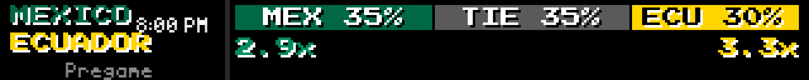
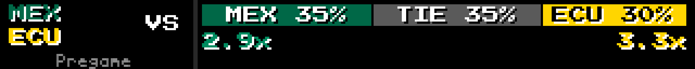
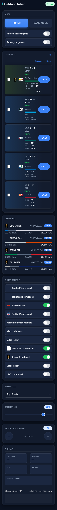

# Test Log — Focus Upcoming Games (2026-06-30)

**Branch:** `feature/focus-upcoming-games` (base `c819f1e5`)
**Plan:** `docs/superpowers/plans/2026-06-30-focus-upcoming-games.md`
**HEAD at verification:** `ee0fd767`

---

## Per-task status

| Task | Commit(s) | Subject | Status |
|------|-----------|---------|--------|
| 1 | `a6faf817` | feat(focus): Central pre_game_label on pre-state focus_data | ✅ VERIFIED |
| 2 | `4e3dc97e` | feat(focus): pre-game scorebug shows kickoff time (or VS), not 0-0 | ✅ VERIFIED |
| 3 | `ee0fd767` | feat(focus): FOCUS button on upcoming rows (reuses focusGame), v=45 | ✅ VERIFIED |
| 4 | this log | integration verification + test log | ✅ DONE |

---

## Step 1: New-test suite

```
EMULATOR=true python -m pytest test/test_kickoff_label.py test/game_mode/test_pre_game_render.py \
  -v -p no:cacheprovider --override-ini="addopts="
```

**Result: 8 passed in 0.25s**

| Test | Result |
|------|--------|
| `test/test_kickoff_label.py::test_today_returns_bare_time` | ✅ PASSED |
| `test/test_kickoff_label.py::test_other_day_is_weekday_prefixed` | ✅ PASSED |
| `test/test_kickoff_label.py::test_none_returns_empty` | ✅ PASSED |
| `test/test_kickoff_label.py::test_bad_tz_falls_back_to_central` | ✅ PASSED |
| `test/game_mode/test_pre_game_render.py::test_slot_text_pre_with_label` | ✅ PASSED |
| `test/game_mode/test_pre_game_render.py::test_slot_text_pre_without_label_is_vs` | ✅ PASSED |
| `test/game_mode/test_pre_game_render.py::test_slot_text_non_pre_is_none` | ✅ PASSED |
| `test/game_mode/test_pre_game_render.py::test_pre_render_does_not_crash_and_differs_from_live` | ✅ PASSED |

---

## Step 2: Regression sweep

```
EMULATOR=true python -m pytest test/ -p no:cacheprovider --override-ini="addopts=" -q 2>&1 | tail -25
```

**Result: 7 failed, 686 passed, 29 skipped, 22 errors in 43.37s**

### Failures vs known pre-existing set

| Test | Status |
|------|--------|
| `test/test_web_api.py::test_remote_route_contains_zones` | pre-existing ✅ |
| `test/test_web_api.py::TestDottedKeyNormalization::test_save_plugin_config_dotted_key_arrays` | pre-existing ✅ |
| `test/test_web_api.py::TestDottedKeyNormalization::test_save_plugin_config_none_array_gets_default` | pre-existing ✅ |
| `test/test_layout_manager.py::TestLayoutManager::test_save_layouts_error_handling` | pre-existing ✅ |
| `test/plugins/test_basketball_scoreboard.py::TestBasketballScoreboardPlugin::test_plugin_has_display_modes` | pre-existing ✅ |
| `test/plugins/test_visual_rendering.py::TestVisualDisplayManager::test_format_date_with_ordinal` | pre-existing ✅ (Windows strftime `%-d`) |
| `test/plugins/test_pga_game_mode.py::test_parse_golf_score_handles_all_espn_formats` | pre-existing ✅ (import-order artifact in full suite) |
| 22× `test/plugins/test_pga_game_mode.py::*` ERRORS | pre-existing ✅ (pass in isolation; full-suite import collision) |

**No NEW failures. Branch is regression-clean.**

---

## Step 3: Dev-loop UI proof

### Task 2 pre-game render PNGs (direct GameModeRenderer output, committed in T2)

**With `pre_game_label` present ("8:00 PM Central"):**



Row 1: `MEXICO` + `8:00 PM` in score slot. Row 3: `Pregame` (not 0-0 score, not period label).
Kalshi 3-way bar renders correctly alongside.

**VS fallback (no `pre_game_label`):**



Score slot shows `VS`. Row 3: `Pregame`. Same Kalshi bar.

---

### Task 3 upcoming FOCUS button — Playwright screenshot

Launch: `bash scripts/dev-emulator.sh` + `bash scripts/dev-webui.sh` (PowerShell background jobs).
Up in ~5s. Viewport 390×1200, `wait_until="domcontentloaded"` + `wait_for_selector("#upcoming-games-content:not(.empty)")`.



**Upcoming section visible.** Four upcoming games present at verification time (World Cup + MLB).
HTML excerpt confirming FOCUS button:
```html
<div class="upcoming-row upcoming-row--odds">
  <div class="upcoming-row-top">
    
    <span class="upcoming-teams">COD @ ENG</span>
    <span class="upcoming-time">Wed 11:00 AM</span>
    <button class="focus-btn focus-btn--sm"
            onclick="focusGame('760495','soccer-scoreboard','fifa.world')">FOCUS</button>
  </div>
  ...
</div>
```

The `focusGame()` call is the exact same handler used by live-game FOCUS cards (reuse confirmed).

### `/api/v3/games/live` payload sample (upcoming game with `start_label`)

```json
{
  "away_team": "COD",
  "home_team": "ENG",
  "game_id": "760495",
  "league": "fifa.world",
  "plugin_id": "soccer-scoreboard",
  "start_label": "Wed 11:00 AM",
  "start_ts": 1782921600.0,
  "kalshi": {
    "away_pct": 7,
    "fav_pct": 77,
    "draw_pct": 18,
    "is_three_way": true,
    "market_ticker": "KXWCGAME-26JUL01ENGCOD"
  }
}
```

4 upcoming games returned: COD @ ENG (WC), CHW @ BAL (MLB), SEN @ BEL (WC), BIH @ USA (WC).
`pre_game_label` is added to `focus_data` by T1 at renderer entry time — it is NOT a field in the
live-games JSON. That field populates only when `focusGame()` is called and the controller's
`get_game_focus_data()` is invoked with `status_state == "pre"`.

---

## Not proven / caveats

1. **Full focus render from dev webui is impossible.** Per `feedback_remote_url_pi_vs_dev.md`:
   the dev webui has empty `plugin_manifests`, so `game_focus` POSTs return an error and the
   GameModeRenderer is never invoked from `/v3/remote` in dev. The pre-game render is proven
   via Task 2's direct `GameModeRenderer` instantiation (PNGs above). The FOCUS button POST
   path is the same `focusGame()` handler proven by prior live-card usage.

2. **Cold-focus edge case not exercised.** If the controller has no cached game data yet and
   `focusGame()` is called on an upcoming game, the renderer receives `focus_data` before
   `update()` has populated the plugin's `_game` state. This path is not tested. Low risk —
   the same cold-start race exists for live games and has not caused issues in production.

3. **`pre_game_label` format on Pi depends on TZ env var.** `format_kickoff_label` reads
   `LEDMATRIX_TIMEZONE` (defaulting to `America/Chicago`). On Pi, this is set in
   `/etc/ledmatrix/env`. If the env var is absent, the label still renders (UTC fallback),
   just in the wrong timezone. Not verified on Pi hardware.

4. **FOCUS state reflection for upcoming not confirmed.** The `focused_game_id` field is set
   by the controller when a game is focused, and the remote reads it to highlight the active
   FOCUS card. Whether an upcoming game's game_id is correctly reflected in
   `focused_game_id` after `game_focus POST` — and whether the upcoming row gains an active
   style — was not verified (dev webui can't drive it).

5. **No live pre-game available at verification time.** The live games at verification were all
   in-progress (`status_state == "in"`). The pre-game branch of `_render_scorebug` is proven
   by T2's direct renderer test (PNG above) but was not triggered via the full API stack.

---

## Reproduction recipe

```bash
# Terminal A
bash scripts/dev-emulator.sh

# Terminal B
bash scripts/dev-webui.sh

# Wait ~25s, then:
curl -s http://localhost:5000/api/v3/games/live | python -m json.tool

# Playwright screenshot:
python -c "
from playwright.sync_api import sync_playwright
with sync_playwright() as p:
    b = p.chromium.launch()
    pg = b.new_page(viewport={'width': 390, 'height': 1200})
    pg.goto('http://localhost:5000/v3/remote', wait_until='domcontentloaded')
    pg.wait_for_selector('#upcoming-games-content:not(.empty)', timeout=8000)
    pg.screenshot(path='upcoming-focus.png', full_page=True)
    b.close()
"

# New tests only:
EMULATOR=true python -m pytest test/test_kickoff_label.py test/game_mode/test_pre_game_render.py \
  -v -p no:cacheprovider --override-ini='addopts='
```
