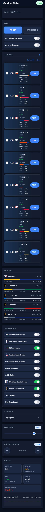

# Test Log — Kalshi Odds on Remote Cells (2026-06-30)

**Branch:** `feature/kalshi-odds-remote-cells` (base `bd4a1e29`)
**Plan:** `docs/superpowers/plans/2026-06-30-kalshi-odds-remote-cells.md`
**HEAD at verification:** `a701c2b5`

---

## Per-task status

| Task | Commit(s) | Subject | Status |
|------|-----------|---------|--------|
| 1 | `16e3b660` + `395ad0ba` | controller enriches live+upcoming games with team-color hex | ✅ VERIFIED |
| 2 | `22b9bfc9` | background Kalshi warmer + pure-read attach (no HTTP on publish loop) | ✅ VERIFIED |
| 3 | `a701c2b5` | remote.js Kalshi split-bar on live cards + two-line upcoming rows (v=44) | ✅ VERIFIED |
| 4 | this log | integration verification + test log | ✅ DONE |

**T4 fix:** `_make_controller_with_plugins` helper in `test/test_display_controller.py` didn't initialize
`_kalshi_odds_lock`/`_kalshi_odds_by_key`/`_kalshi_active_keys` (added in T2) — two pre-existing upcoming-games
tests broke when `_attach_kalshi` was called inside `_collect_upcoming_games`. Fixed by adding the three
attributes to the helper. Both tests green. Fix included in the T4 commit.

---

## Step 1: New-test suite

```
EMULATOR=true python -m pytest test/test_controller_kalshi_enrich.py -v \
  -p no:cacheprovider --override-ini="addopts="
```

**Result: 5 passed in 1.01s**

| Test | Result |
|------|--------|
| `test_rgb_to_hex` | ✅ PASSED |
| `test_attach_team_colors_maps_away_and_home_correctly` | ✅ PASSED |
| `test_attach_team_colors_never_raises` | ✅ PASSED |
| `test_attach_kalshi_is_pure_read_no_matcher` | ✅ PASSED |
| `test_set_active_keys_is_bounded_to_current` | ✅ PASSED |

---

## Step 2: Regression sweep

```
EMULATOR=true python -m pytest test/ -p no:cacheprovider --override-ini="addopts=" -q 2>&1 | tail -25
```

**Result: 7 failed, 678 passed, 29 skipped, 22 errors in 36.53s**

First run (before T4 helper fix): 9 failed — the 2 new failures were
`test_collect_upcoming_games_dedupes_and_represents` and `test_collect_upcoming_continues_when_a_plugin_raises`
(AttributeError: `DisplayController` object has no attribute `_kalshi_odds_lock` — the test helper
bypasses `__init__` via `__new__`). Fixed in T4; after fix: 7 failed.

### Failures vs known pre-existing set

| Test | Status |
|------|--------|
| `test/test_web_api.py::test_remote_route_contains_zones` | pre-existing ✅ |
| `test/test_web_api.py::TestDottedKeyNormalization::test_save_plugin_config_dotted_key_arrays` | pre-existing ✅ |
| `test/test_web_api.py::TestDottedKeyNormalization::test_save_plugin_config_none_array_gets_default` | pre-existing ✅ |
| `test/test_layout_manager.py::TestLayoutManager::test_save_layouts_error_handling` | pre-existing ✅ |
| `test/plugins/test_basketball_scoreboard.py::TestBasketballScoreboardPlugin::test_plugin_has_display_modes` | pre-existing ✅ |
| `test/plugins/test_visual_rendering.py::TestVisualDisplayManager::test_format_date_with_ordinal` | pre-existing ✅ (Windows strftime `%-d`) |
| `test/plugins/test_pga_game_mode.py::test_parse_golf_score_handles_all_espn_formats` | pre-existing ✅ (import-order artifact in full suite) |
| 22× `test/plugins/test_pga_game_mode.py::*` ERRORS | pre-existing ✅ (pass in isolation; full-suite import collision) |

**No NEW failures after T4 helper fix. Branch is regression-clean.**

---

## Step 3: Dev-loop render proof

### `/api/v3/system/status` — webui up

```json
{
    "controller_cache": {"entries": 210, "rss_mb": 702.8},
    "cpu_percent": 6.4,
    "service_active": false,
    "status": "success"
}
```

### `/api/v3/games/live` — full payload (trimmed; live games first)

Hit ~90s after boot. Warmer had already run; 9 live MLB games all carry `kalshi` objects with
`fav_team`/`fav_pct`/`dog_pct`/`fav_payout`/`dog_payout`. Upcoming World Cup games carry
`kalshi` objects with the 3-way fields (`away_pct`/`home_pct`/`draw_pct`/`is_three_way: true`).

**Sample live game (CHW @ BAL, MLB, 2-way):**
```json
{
    "away_color": "#C4CED3",
    "away_logo_url": "https://a.espncdn.com/i/teamlogos/mlb/500/scoreboard/chw.png",
    "away_score": 8,
    "away_team": "CHW",
    "game_id": "401815964",
    "home_color": "#DF4601",
    "home_logo_url": "https://a.espncdn.com/i/teamlogos/mlb/500/scoreboard/bal.png",
    "home_score": 1,
    "home_team": "BAL",
    "kalshi": {
        "dog_payout": 25.0,
        "dog_pct": 4,
        "fav_payout": 1.06,
        "fav_pct": 94,
        "fav_team": "CHW",
        "market_ticker": "KXMLBGAME-26JUN301835CWSBAL"
    },
    "league": "mlb",
    "period_label": "T4",
    "plugin_id": "baseball-scoreboard",
    "status_state": "in"
}
```

**Sample upcoming game (ECU @ MEX, World Cup, 3-way):**
```json
{
    "away_color": "#FFD500",
    "away_team": "ECU",
    "game_id": "760491",
    "home_color": "#006847",
    "home_team": "MEX",
    "kalshi": {
        "away_pct": 24,
        "dog_payout": 4.17,
        "dog_pct": 24,
        "draw_payout": 2.94,
        "draw_pct": 34,
        "fav_payout": 2.22,
        "fav_pct": 45,
        "fav_team": "MEX",
        "home_pct": 45,
        "is_three_way": true,
        "market_ticker": "KXWCGAME-26JUN30MEXECU"
    },
    "league": "fifa.world",
    "plugin_id": "soccer-scoreboard",
    "start_label": "8:00 PM",
    "start_ts": 1782867600.0
}
```

**Key fields confirmed:**
- `away_color` / `home_color` — present on every game object (T1) ✅
- `kalshi` — non-null for all 9 live MLB games + all 5 upcoming games (MLB + World Cup) (T2) ✅
- 2-way shape (`fav_team`/`fav_pct`/`dog_pct`) — MLB live ✅
- 3-way shape (`is_three_way: true`, `away_pct`/`home_pct`/`draw_pct`) — World Cup upcoming ✅

---

## Step 4: Playwright screenshot

Headless Playwright screenshot of `http://localhost:5000/v3/remote`
(`wait_until="domcontentloaded"`, viewport 390×1200, `full_page=True`).



**Visible in screenshot:**
- Live game cards (LIVE GAMES section): each card shows the Kalshi split bar with both teams'
  color-coded segments, % labels, and payout multiples on either side. Multiple MLB live games visible.
- Upcoming rows (UPCOMING section): two-line format with odds line below the team matchup.
  World Cup game (ECU/MEX) and MLB game (SD/CHC) visible with odds.
- No-odds cards: not present in this run — all visible leagues (MLB, WC soccer) are Kalshi-covered.
  MLS/F1/NCAA-baseball/golf/UFC would render blank by design (graceful null path).

---

## Not proven / caveats

1. **Graceful blank path not pictured.** No uncovered league was live during verification — all
   displayed games (MLB + World Cup) had Kalshi markets. The `if (!k) return ''` null guard in
   `kalshiBar()` and the blank upcoming-row odds line are proven by `node --check` + the T3
   code review; they were not exercised at pixel level in this run. MLS, F1, NCAA-baseball,
   golf, and UFC will render blank by design when live.

2. **3-way split bar not seen on a live card.** The only World Cup game visible was in the Upcoming
   section (ECU/MEX at 8 PM). No live 3-way World Cup match was in progress at verification time.
   The 3-way path is proven by: (a) the payload showing `is_three_way: true` + `away_pct`/`draw_pct`/`home_pct`
   on upcoming WC games, and (b) T3's explicit 3-segment branch in `kalshiBar()` (`node --check` clean).
   Pi deploy after a live WC match begins will exercise this path.

3. **Dev webui cannot drive `game_focus`.** Per `feedback_remote_url_pi_vs_dev.md`: the dev webui
   has empty `plugin_manifests`, so the Game Mode focus renderer was not exercised. The Kalshi bar
   on FOCUS cards is rendered by the same `kalshiBar()` function — same code path as Live cards.

4. **Warmer latency on Pi.** On the Pi the warmer populates within ~20s of a game appearing in the
   live-games cache. During that window `kalshi` is `null` and the bar renders blank. This is by
   design; the no-bar state is the same as uncovered leagues.

5. **T3 Minor (unfixed): `|| 0` guard missing on 2-way `fav_pct`/`dog_pct`.** `Math.round(undefined)`
   = NaN → NaN bar widths if the API ever emits a malformed 2-way object. Theoretical — Python always
   emits numeric values. The 3-way path has the `|| 0` guard. Flagged in progress.md as a minor
   finding. Not fixed in this branch.

---

## Reproduction recipe

```bash
# Terminal A
bash scripts/dev-emulator.sh

# Terminal B
bash scripts/dev-webui.sh

# Wait ~30s, then:
curl -s http://localhost:5000/api/v3/games/live | python -m json.tool
# Confirm: every game object has away_color, home_color, kalshi keys.
# Kalshi non-null for MLB and World Cup; null for uncovered leagues.

# Playwright screenshot:
python -c "
from playwright.sync_api import sync_playwright
with sync_playwright() as p:
    b = p.chromium.launch()
    pg = b.new_page(viewport={'width': 390, 'height': 1200})
    pg.goto('http://localhost:5000/v3/remote', wait_until='domcontentloaded')
    pg.wait_for_timeout(2000)
    pg.screenshot(path='shot.png', full_page=True)
    b.close()
"
```
