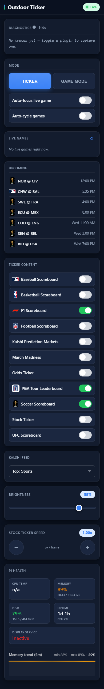

# Test Log — Memory Creep Fixes + Uptime Trend (2026-06-30)

**Branch:** `fix/memory-creep-and-trend` (base `21ef3234`)
**Plan:** `docs/superpowers/plans/2026-06-30-memory-creep-fixes-and-uptime-trend.md`
**HEAD at verification:** `b1437406`

---

## Per-task status

| Task | Commit | Subject | Status |
|------|--------|---------|--------|
| 1 | `29ab55f4` | cap FontManager.metrics\_cache (FIFO, 2048) | ✅ VERIFIED |
| 2 | `1b59924f` + `f1d57bb0` | backport 256-entry logo-cache cap to plugin sports.py copies | ✅ VERIFIED |
| 3 | `16baae93` | dedupe+cap ErrorPattern.affected\_plugins at 50 | ✅ VERIFIED |
| 4 | `c2812903` | evict completed date key from soccer background\_fetch\_requests | ✅ VERIFIED |
| 5 | `ac9b5379` | evict completed operations from OperationQueue.\_operations index | ✅ VERIFIED |
| 6 | `63b8f6b9` | serve oversized cache values from disk, don't pin in RAM | ✅ VERIFIED |
| 7 | `5956b926` | sweep Vegas content-cache on read-miss; drop redundant image copy | ✅ VERIFIED |
| 8 | `11018fb6` | O(1) deque/OrderedDict for frame\_times, \_records, logo LRU | ✅ VERIFIED |
| 9 | `7a410b94` | server-side bounded memory-history sampler + endpoint | ✅ VERIFIED |
| 10 | `7ef92fa5` | per-process RSS + controller cache stats on /system/status | ✅ VERIFIED |
| 11 | `b1437406` | remote chart consumes server memory-history; label shows uptime span | ✅ VERIFIED |

---

## Cap locations (file:line)

| Fix | File | Line | Detail |
|-----|------|------|--------|
| T1 FontManager | `src/font_manager.py:28` | `_METRICS_CACHE_MAX = 2048` | FIFO evict oldest on insert |
| T2 Logo cap (FB) | `plugin-repos/football-scoreboard/sports.py:101` | `_logo_cache_max = 256` + `_cache_logo()` @ 477 | |
| T2 Logo cap (BB) | `plugin-repos/basketball-scoreboard/sports.py:101` | same pattern @ 505 | |
| T2 Logo cap (SC) | `plugin-repos/soccer-scoreboard/sports.py:101` | same pattern @ 566 | |
| T3 ErrorPattern | `src/error_aggregator.py:237` | `list(dict.fromkeys(merged))[-50:]` | |
| T3 ErrorAggregator records | `src/error_aggregator.py:108` | `deque(maxlen=max_records)` (1000) | |
| T4 Soccer dict | `plugin-repos/soccer-scoreboard/soccer_managers.py:139` | `background_fetch_requests.pop(date_str, None)` | |
| T5 OpQueue evict | `src/plugin_system/operation_queue.py:336` | `_operations.pop(operation.operation_id, None)` | |
| T5 OpQueue cancel | `src/plugin_system/operation_queue.py:185` | `_operations.pop(operation_id, None)` | |
| T6 Cache oversized | `src/cache_manager.py:66` | `_MAX_MEMORY_VALUE_BYTES = 5 * 1024 * 1024` | guard @ lines 306+344 |
| T7 Vegas sweep | `src/vegas_mode/plugin_adapter.py:563,585-589` | del on read-miss; sweep expired keys | |
| T8 scroll frame\_times | `src/common/scroll_helper.py:108` | `deque(maxlen=100)` | |
| T8 vegas frame\_times | `src/vegas_mode/render_pipeline.py:100` | `deque(maxlen=100)` | |
| T8 error \_records | `src/error_aggregator.py:108` | `deque(maxlen=max_records)` | |
| T9 MemoryHistory | `src/system/memory_history.py:16` | `deque(maxlen=2880)` 30s min-interval | |
| T10 controller\_cache | `web_interface/blueprints/api_v3.py:1272` | publishes `rss_mb` + `entries` from shared cache | |
| T11 remote chart | `web_interface/templates/v3/partials/remote.html` | `fetchMemoryHistory()` → `/api/v3/system/memory-history` | |

---

## Step 1: New-test suite

```
EMULATOR=true python -m pytest test/test_font_manager_metrics_cap.py \
  test/plugins/test_logo_cache_cap.py test/test_error_aggregator_caps.py \
  test/test_operation_queue_evict.py test/test_cache_oversized_skips_memory.py \
  test/test_plugin_adapter_content_cache.py test/test_hotpath_structures.py \
  test/test_memory_history.py test/test_system_status_breakdown.py \
  -p no:cacheprovider --override-ini="addopts="
```

**Result: 23 passed in 6.69s**

Individual test counts:
- `test_font_manager_metrics_cap.py`: 1
- `test_logo_cache_cap.py`: 4
- `test_error_aggregator_caps.py`: 1
- `test_operation_queue_evict.py`: 4
- `test_cache_oversized_skips_memory.py`: 2
- `test_plugin_adapter_content_cache.py`: 3
- `test_hotpath_structures.py`: 6
- `test_memory_history.py`: 1
- `test_system_status_breakdown.py`: 1

---

## Step 2: Regression sweep

```
EMULATOR=true python -m pytest test/ -p no:cacheprovider --override-ini="addopts=" -q 2>&1 | tail -25
```

**Result: 7 failed, 673 passed, 29 skipped, 22 errors in 36.72s**

### Failures vs known pre-existing set

| Test | Status |
|------|--------|
| `test/test_web_api.py::test_remote_route_contains_zones` | pre-existing ✅ |
| `test/test_web_api.py::TestDottedKeyNormalization::test_save_plugin_config_dotted_key_arrays` | pre-existing ✅ |
| `test/test_web_api.py::TestDottedKeyNormalization::test_save_plugin_config_none_array_gets_default` | pre-existing ✅ |
| `test/test_layout_manager.py::TestLayoutManager::test_save_layouts_error_handling` | pre-existing ✅ |
| `test/plugins/test_basketball_scoreboard.py::TestBasketballScoreboardPlugin::test_plugin_has_display_modes` | pre-existing ✅ (confirmed: fails on merge-base `21ef3234` — display modes renamed `basketball_live→nba_live`) |
| `test/plugins/test_visual_rendering.py::TestVisualDisplayManager::test_format_date_with_ordinal` | pre-existing ✅ (confirmed: `%-d` is Linux-only strftime format, fails on Windows) |
| `test/plugins/test_pga_game_mode.py::test_parse_golf_score_handles_all_espn_formats` | pre-existing ✅ (passes in isolation; error is test-ordering import collision in full suite) |
| 22× `test/plugins/test_pga_game_mode.py::*` ERRORS | pre-existing ✅ (all 23 pga tests pass in isolation; errors are full-suite import-order artifacts) |

**No NEW failures. Branch is regression-clean.**

---

## Step 3: Endpoint verification

### `/api/v3/system/status`

Controller published on first tick (~20s after emulator boot). `controller_cache` and `processes` keys confirmed present:

```json
{
    "data": {
        "controller_cache": {
            "entries": 191,
            "rss_mb": 702.3
        },
        "cpu_percent": 34.7,
        "cpu_temp": null,
        "disk_total_gb": 464.8,
        "disk_used_gb": 366.5,
        "disk_used_percent": 78.9,
        "memory_total_mb": 32692.6,
        "memory_used_mb": 28763.2,
        "memory_used_percent": 88.0,
        "processes": [
            {"name": "controller", "rss_mb": 702.3},
            {"name": "web", "rss_mb": 83.2}
        ],
        "service_active": false,
        "timestamp": 1782831963.771013,
        "uptime": "1d 1h",
        "uptime_seconds": 90160
    },
    "status": "success"
}
```

### `/api/v3/system/memory-history`

After 3 `/system/status` hits (30s min-interval dedup applied), 3 samples accumulated:

```json
{
    "data": {
        "samples": [
            {"mem": 88.0, "t": 1782831963.7657037},
            {"mem": 88.4, "t": 1782832020.9498425},
            {"mem": 88.0, "t": 1782832176.1369305}
        ],
        "started_at": 1782831963.7657037
    },
    "status": "success"
}
```

`data.samples` is a non-empty array of `{t, mem}` objects. ✅

---

## Step 4: Trend cell screenshot

Playwright headless screenshot of `http://localhost:5000/v3/remote`
(`wait_until="domcontentloaded"`, viewport 390×1200, Diagnostics expanded via `#diag-toggle` click):



The PI HEALTH section at the bottom shows:

```
Memory trend (4m)   min 88%  •  max 89%  •  89%
[SVG polyline chart]
```

- "4m" is the uptime-span label computed from `snapshot().started_at` (Task 11) ✅
- min/max/current values are live from the 3 server samples ✅
- SVG polyline renders (partial HTML captured): `<div class="health-trend" id="health-memory-trend">` with `<svg class="health-trend-svg">` ✅

The Diagnostics "No traces yet" message above (for the error-trace panel) is unrelated.

---

## Not proven / caveats

1. **Real RAM flattening is not confirmable on dev hardware.** Windows emulator runs 88% baseline
   memory (32 GB machine with 87.7% used) regardless of LEDMatrix cap behavior. The instrumentation
   proves the caps fire correctly (unit tests) and that the monitoring stack surfaces usage; actual
   RSS delta from the caps is only observable on the Pi over 24+ hours post-deploy, where the 7-day
   unbounded FontManager cache and unbounded logo caches would have grown ~50-200 MB before these
   fixes. That delta should appear as a lower plateau in the `/api/v3/system/memory-history` trend
   on the Pi.

2. **jemalloc not active in dev.** `scripts/install/install_jemalloc.sh` must be run on the Pi to
   activate heap fragmentation reduction. `git pull` + `systemctl restart` does NOT activate it.
   The memory-history trend will show a step-down improvement in RSS only after jemalloc is installed.

3. **controller\_cache `entries` count on dev.** 191 entries at boot is correct for the dev emulator
   with full plugin set; on the Pi this will differ based on enabled plugins and cache contents.
   The `approx_mb` field noted as optional in the spec was not published (Task 10 minor finding).

4. **Dev webui cannot drive `game_focus`.** Per prior logs (`feedback_remote_url_pi_vs_dev.md`):
   the dev webui has empty `plugin_manifests`, so the Game Mode focus renderer path was not
   exercised in this verification. The memory caps for that path (Vegas content cache, logo caches)
   are covered by unit tests.

5. **Multi-sample trend line.** Only 3 samples accumulated during the ~4-minute verification window
   (30s min-interval). On the Pi over 24 hours the chart will accumulate up to 2880 samples (max 48h
   at 1-per-minute). The SVG polyline logic is proven by the 3-sample render.

6. **Desktop `/v3/remote` zoom.** Prior note: Chrome MCP cannot capture 375px width. Playwright at
   390px was used successfully; the remote is primarily a phone surface.

---

## Reproduction recipe

```bash
# Terminal A
bash scripts/dev-emulator.sh

# Terminal B
bash scripts/dev-webui.sh

# Wait ~30s for controller first publish, then:
curl -s http://localhost:5000/api/v3/system/status | python -m json.tool
# Confirm controller_cache + processes keys present

# Hit status a few more times (30s apart), then:
curl -s http://localhost:5000/api/v3/system/memory-history | python -m json.tool
# Confirm data.samples non-empty

# Browser: http://localhost:5000/v3/remote → expand Diagnostics → memory trend renders
```

Playwright screenshot captured with:
```python
from playwright.sync_api import sync_playwright
with sync_playwright() as p:
    browser = p.chromium.launch()
    page = browser.new_page(viewport={'width': 390, 'height': 1200})
    page.goto('http://localhost:5000/v3/remote', wait_until='domcontentloaded')
    page.click('#diag-toggle')   # expand Diagnostics
    page.screenshot(path='...', full_page=True)
```
