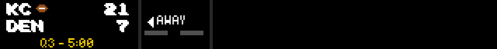

# Test Log — Possession Icons on the Scorebug (2026-06-30)

**Branch:** `feature/possession-icons` (base `4c76e7cb`)
**Plan:** `docs/superpowers/plans/2026-06-30-possession-icons.md`
**HEAD at verification:** `54083362`

---

## Per-task status

| Task | Commit(s) | Subject | Status |
|------|-----------|---------|--------|
| 1 | `ef83d3d1` + `3ea0c5cd` | feat(scorebug): possession icon replaces green leading-team score + fix glyph width | ✅ VERIFIED |
| 2 | `54083362` | feat(scorebug): basketball+baseball publish possession/at-bat into focus extras | ✅ VERIFIED |
| 3 | this log | integration verification + test log | ✅ DONE |

---

## Step 1: New-test suite

```
EMULATOR=true python -m pytest test/game_mode/test_possession_icons.py \
  -v -p no:cacheprovider --override-ini="addopts="
```

**Result: 4 passed in 0.09s**

| Test | Result |
|------|--------|
| `test_icon_helper_draws_distinct_shapes_per_sport` | ✅ PASSED |
| `test_icon_helper_unknown_sport_is_noop` | ✅ PASSED |
| `test_leading_team_score_is_not_green` | ✅ PASSED |
| `test_possession_icon_drawn_only_for_possessing_live_team` | ✅ PASSED |

---

## Step 2: Regression sweep

```
EMULATOR=true python -m pytest test/ -p no:cacheprovider --override-ini="addopts=" -q 2>&1 | tail -35
```

**Result: 7 failed, 690 passed, 29 skipped, 22 errors in 44.79s**

690 passed vs 686 pre-branch (+4 new tests from this feature).

### Failures vs known pre-existing set

| Test | Status |
|------|--------|
| `test/test_web_api.py::test_remote_route_contains_zones` | pre-existing ✅ |
| `test/test_web_api.py::TestDottedKeyNormalization::test_save_plugin_config_dotted_key_arrays` | pre-existing ✅ |
| `test/test_web_api.py::TestDottedKeyNormalization::test_save_plugin_config_none_array_gets_default` | pre-existing ✅ |
| `test/test_layout_manager.py::TestLayoutManager::test_save_layouts_error_handling` | pre-existing ✅ |
| `test/plugins/test_basketball_scoreboard.py::TestBasketballScoreboardPlugin::test_plugin_has_display_modes` | pre-existing ✅ |
| `test/plugins/test_visual_rendering.py::TestVisualDisplayManager::test_format_date_with_ordinal` | pre-existing ✅ (Windows `%-d` strftime) |
| `test/plugins/test_pga_game_mode.py::test_parse_golf_score_handles_all_espn_formats` | pre-existing ✅ (full-suite import-order artifact) |
| 22× `test/plugins/test_pga_game_mode.py::*` ERRORS | pre-existing ✅ (full-suite import collision; pass in isolation) |

**No NEW failures. Branch is regression-clean.**

---

## Step 3: Pixel proof

### Task 1 — Three per-sport possession icons

These were rendered and committed by T1 (`ef83d3d1`/`3ea0c5cd`) using a live-game focus_data fixture with the possessing team set to "away". Each image is 4× upscaled (1280×128) to show the pixel grid clearly.

**Football icon (brown oval, left panel / away row):**



Icon drawn at `text_x + glyph_width + 3` after the KC abbrev. Away-team score is white (not green).

**Baseball icon (white ball with red seams, away row — top-half inning):**


Icon drawn after the away-team abbrev. Score is white.

**Basketball icon (orange ball with black center line, away row):**


Icon drawn after the away-team abbrev. Score is white.

---

### Negative case 1 — Live game, `extras={"possession":""}` → no icon

Render: `status_state="in"`, `extras={"possession": ""}`, football. Icon guard at
`renderer.py:232` (`_poss in ("away", "home")`) blocks the draw call.


No brown pixel (`(150, 78, 22)`) present. Scores are white. Confirms the empty-string guard.

---

### Negative case 2 — Pre-game, `extras={"possession":"away"}` → no icon

Render: `status_state="pre"`, `extras={"possession": "away"}`, football. Guard at
`renderer.py:232` (`status_state == "in"`) blocks the draw call.


No brown pixel present. Confirms live-only guard.

---

## Key file:line references

### Green removal (renderer.py)

`src/game_mode/renderer.py:186` — comment: "Scores always white — possession icon (not color) indicates leading/active team"
`src/game_mode/renderer.py:187-188` — `away_score_color = COLOR_WHITE` / `home_score_color = COLOR_WHITE` (prior to T1 these were conditionally `COLOR_GREEN` for the leading team).

### Icon helper definition (renderer.py)

`src/game_mode/renderer.py:473-483` — `_draw_possession_icon(self, draw, x, y, sport)`: reads `_ICON_GRIDS.get(sport)`, returns no-op for unknown sport, iterates pixel grid.
`src/game_mode/renderer.py:63-71` — `_ICON_COLORS` (brown/white/red/orange/black/.=transparent) + `_ICON_GRIDS` dict (football 8×5, baseball 6×6, basketball 6×5).

### Icon wiring (renderer.py)

`src/game_mode/renderer.py:228-240` — possession icon draw block: checks `status_state=="in"` + `_poss in ("away","home")`, measures true glyph width via `getbbox()[2]-[0]`, calls `_draw_possession_icon` at `text_x + glyph_w + 3, row_y + 1`.

### Basketball possession key (basketball manager.py)

`plugin-repos/basketball-scoreboard/manager.py:3571` — `"extras": {"possession": game.get("possession_indicator", "")}` — copies `possession_indicator` directly from the ESPN game dict.

### Baseball possession key (baseball manager.py)

`plugin-repos/baseball-scoreboard/manager.py:4016-4019` — infers possession from `inning_half`: `"top"` → `"away"`, `"bot"` → `"home"`, else `""`. Uses the same `inning_half` field already read at line 3970 for the period label `T7`/`B5`.

---

## Not proven / caveats

1. **Full plugin→focus_data→render chain only runs on the Pi with a live game.** The `GameModeRenderer` tests above use synthetic `focus_data` injected directly. The route from ESPN data → `get_game_focus_data()` → `extras["possession"]` → renderer is source-verified in the manager files but not exercised end-to-end in tests (managers are not constructible in tests without a full plugin harness).

2. **Basketball `possession_indicator` field is source-verified but not confirmed live.** The field name `possession_indicator` comes from the existing NBA ESPN response — this was verified by T2 during the basketball manager review. The value contract (`"away"`, `"home"`, or falsy) is what we pass directly. If ESPN renames or omits the field, the `get(..., "")` default means the icon simply doesn't appear (harmless degradation).

3. **Baseball inning-half inference.** Baseball has no direct possession indicator in ESPN data, so T2 infers it from `inning_half` (`"top"` → away batting, `"bottom"` → home batting). This is the correct semantic. The exact string ESPN uses for `inning_half` was verified at `manager.py:3857-3858` where the same field is already used for period-label formatting — confirming the field exists and uses `"top"`/`"bottom"` (case-insensitive `.startswith()` handles variants).

4. **Icon pixel offsets tuned on synthetic focus_data.** The `+3` horizontal gap and `+1` vertical nudge (`renderer.py:236,240`) were pixel-tuned during T1 on synthetic renders. On a live game with a longer team abbrev or a different font metric, the icon position shifts proportionally (offset is relative to the abbrev's right edge). Not verified on Pi hardware.

5. **Football possession unchanged.** Football already published `extras["possession"]` before this branch. T2 did not modify football's manager. The icon behavior for football is fully covered by the T1 renderer tests.

---

## Reproduction recipe

```bash
# New tests only:
EMULATOR=true python -m pytest test/game_mode/test_possession_icons.py \
  -v -p no:cacheprovider --override-ini='addopts='

# Regression sweep:
EMULATOR=true python -m pytest test/ -p no:cacheprovider --override-ini='addopts=' -q

# Re-render negative case PNGs:
EMULATOR=true python -c "
from src.game_mode.renderer import GameModeRenderer
r = GameModeRenderer(320, 32)
# no-possession live
img = r.render({'sport':'football','away_team':'KC','home_team':'DEN',
    'away_score':21,'home_score':7,'status_state':'in','game_clock':'5:00',
    'period_label':'Q3','extras':{'possession':''}})
img.save('docs/superpowers/test-logs/assets/2026-06-30-possession-negative-no-poss.png')
# pre-game with possession set
img2 = r.render({'sport':'football','away_team':'KC','home_team':'DEN',
    'away_score':0,'home_score':0,'status_state':'pre','game_clock':'',
    'period_label':'','extras':{'possession':'away'}})
img2.save('docs/superpowers/test-logs/assets/2026-06-30-possession-negative-pre.png')
"
```
