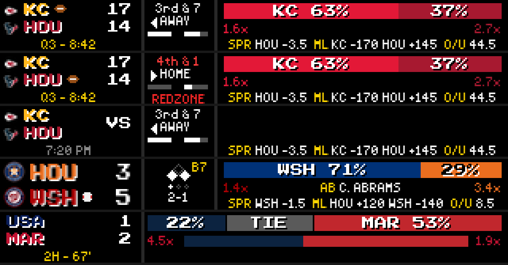
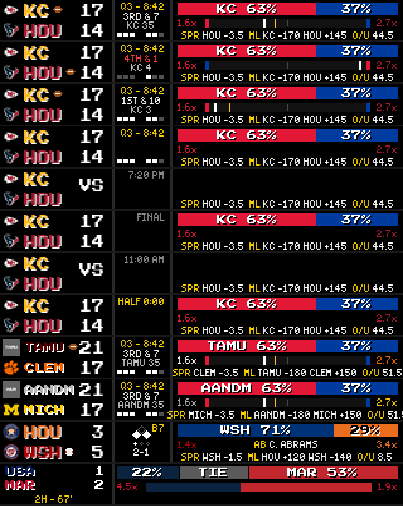

# Test Log — Football Game Mode parity + native extras (2026-09-04)

**Branch:** `feature/football-game-mode-parity` (base `c6144451` on `feature/soccer-worldcup-game-mode`)
**Spec:** `docs/superpowers/specs/2026-09-04-football-game-mode-parity-design.md`
**Plan:** `docs/superpowers/plans/2026-09-04-football-game-mode-parity.md`
**HEAD at verification:** `f601dcdd`

---

## Per-task status

| Task | Commit(s) | Subject | Status |
|------|-----------|---------|--------|
| 1 | `bfdeace8` + `8f779f88` | plugin publishes yard line / ball spot / distance | ✅ VERIFIED |
| 2 | `860618dc` + `abd34ed4` | big 2-row scorebug + state to extras + live gating | ✅ VERIFIED |
| 3 | `5c36aa85` + `ed199997` | extras panel rebuilt | ✅ VERIFIED |
| 4 | `8407d165` + `3eda21b7` | broadcast field-position strip | ✅ VERIFIED |
| 5 | this log | pixel proof + regression sweep | ✅ DONE |
| 6 | `f601dcdd` | fix three defects the pixel proof exposed | ✅ VERIFIED |

Every task passed a spec-compliance + task-quality review; Tasks 1-4 each took one
fix round, Task 6 zero. Reviewers mutation-tested every assertion rather than
reading it — six tests that would have passed against the un-fixed code were
caught and strengthened before the task was marked complete.

---

## Step 1: New-test suites

```
EMULATOR=true python -m pytest test/game_mode/test_renderer_football.py \
  test/plugins/test_football_situation_fields.py -p no:cacheprovider --override-ini="addopts=" -q
```

**Result: 34 passed in 0.65s**

```
EMULATOR=true python -m pytest test/game_mode/ test/plugins/test_football_situation_fields.py \
  -p no:cacheprovider --override-ini="addopts=" -q
```

**Result: 145 passed in 1.30s** (`test/game_mode/` went 111 → 138)

---

## Step 2: Regression sweep

```
EMULATOR=true python -m pytest test/ -p no:cacheprovider --override-ini="addopts=" -q
```

**Result: 7 failed, 764 passed, 29 skipped, 22 errors in 41.04s**

Failures vs the branch's documented pre-existing set:

| Test | Status |
|---|---|
| `test/test_web_api.py::test_remote_route_contains_zones` | pre-existing ✅ |
| `test/test_web_api.py::TestDottedKeyNormalization::test_save_plugin_config_dotted_key_arrays` | pre-existing ✅ |
| `test/test_web_api.py::TestDottedKeyNormalization::test_save_plugin_config_none_array_gets_default` | pre-existing ✅ |
| `test/test_layout_manager.py::TestLayoutManager::test_save_layouts_error_handling` | pre-existing ✅ |
| `test/plugins/test_basketball_scoreboard.py::...::test_plugin_has_display_modes` | pre-existing ✅ |
| `test/plugins/test_visual_rendering.py::...::test_format_date_with_ordinal` | pre-existing ✅ (Windows `%-d` strftime) |
| `test/plugins/test_pga_game_mode.py::test_parse_golf_score_handles_all_espn_formats` | pre-existing ✅ (full-suite import-order artifact) |
| 22× `test/plugins/test_pga_game_mode.py::*` ERRORS | pre-existing ✅ (import collision; pass in isolation) |

Name-for-name identical to the set documented in the 2026-06-30 test log.
**No NEW failures. Branch is regression-clean.**

Baseline cross-check: Task 4's implementer re-ran the full suite on the base
commit via `git stash` and confirmed the identical 7-failure / 22-error set.

---

## Step 3: ESPN ground truth (live, not assumed)

`situation.yardLine` is an **absolute field coordinate: 0 = the home team's goal
line, 100 = the away team's.** Captured live from `UTEP @ OU` (CFB `401856664`)
on 2026-09-04, following one drive by each team:

| possession | `possessionText` | `yardLine` | reading |
|---|---|---|---|
| UTEP (away) | `UTEP 42` | 58 | own 42 → 100−42 |
| UTEP (away) | `OU 48` | 48 | crossed midfield, opponent territory |
| UTEP (away) | `OU 20` | 20 | red zone (`isRedZone: true`) |
| OU (home) | `OU 15` | 15 | own 15 |
| OU (home) | `OU 45` | 45 | own 45 |
| OU (home) | `UTEP 45` | 55 | crossed midfield → 100−45 |

`yardLine` counts **down** as the away team advances and **up** as the home team
advances. Confirmed from both sides, in both territories. No `possessionText`
string parsing is needed.

**ESPN's `situation` is routinely partial.** A live poll between drives returned
`possession` absent, `possessionText: null`, `shortDownDistanceText: null`,
`distance: -1` and a stale `yardLine: 65`. Every new field is guarded
independently and `distance == -1` is normalised to `None`
(`src/base_classes/football.py` `_situation_fields`). The `football_between_drives`
frame below is that exact shape.

Raw captures: `test/fixtures/espn_football_situation_live.json`.

---

## Step 4: Pixel proof

Rendered with `scripts/dev/render_game_mode_frames.py` driving the real
`GameModeRenderer` (the dev web UI cannot drive `game_focus` — its
`plugin_manifests` are empty). 4× upscale.

### Before



Rows 1-3 football (live / red zone / pre-game), row 4 baseball, row 5 soccer.
Football is on the small 3-row scorebug beside baseball's big one, its extras
panel carries a `◄AWAY` label duplicating the scorebug's possession icon plus a
`REDZONE` string duplicating the red down-distance, the payout-row gap is empty
where baseball has `AB C. ABRAMS` and soccer a possession bar, the down-distance
is mixed case, and the pre-game frame still paints timeout bars.

### After



| row | frame | what it proves |
|---|---|---|
| 1 | `football_live` | Big scorebug matching baseball's. Gold `Q3 - 8:42` top-right of the panel, `3RD & 7`, `KC 35`, three countable timeout bars per side. Field strip: KC's red end zone left (they have the ball), ball at 35%, gold line-to-gain, HOU's blue end zone right. |
| 2 | `football_redzone` | HOU driving on KC's 4. `4TH & 1` in red, no `REDZONE` word, `KC 4`. Possession icon on HOU. Field strip mirrored — HOU's blue end zone now left, ball jammed against KC's red end zone right. |
| 3 | `football_own_goal_line` | KC backed up on their own 3. Ball hard left against KC's own red end zone, gold line-to-gain 10 yards out. Proves the mirroring is not cosmetic. |
| 4 | `football_between_drives` | The partial-ESPN shape. Only the state and the timeout bars survive; no down-distance, no spot, **no field strip**. |
| 5 | `football_pre` | `VS` in the score slot, `7:20 PM` in the panel, no situational rows, no field strip. |
| 6 | `football_final` | `FINAL` in the panel, no situational rows, no field strip. |
| 6a | `football_pre_tomorrow` | F2 — a not-today kickoff. `11:00 AM` in the panel (the weekday dropped to fit 38px), **not** `0:00` and **not** `Sat 11:00`. |
| 6b | `football_halftime` | F4 — ESPN keeps `state == "in"` at halftime but sends no `situation`. `HALF 0:00` alone; **no** six-dim-bar timeout stub. |
| 6c | `football_ncaa_tamu` | F1 — TAMU/CLEM with real logos and possession. Labels on the 8px fallback font, football icon intact and clear of the score column. |
| 6d | `football_ncaa_aandm` | F1 extreme — AANDM/MICH. Even the fallback leaves no icon room, so the icon is dropped rather than drawn on the `2` of `21`. Also shows a **pre-existing, out-of-scope** defect: with 5-char abbrevs the ESPN odds line overflows its panel both ways (2px left over the divider, clipped right). Reproduces identically at `cd6aefbd`. |
| 7 | `baseball_live` | Unchanged — byte-identical to its pre-branch render (verified by SHA-256 against `3eda21b7`). **Live frame only:** that check covered `status_state == "in"` and nothing else, and it missed a real regression — baseball's PRE-game frame with a not-today kickoff label was changed by the shared shrink ladder (F3 below). |
| 8 | `soccer_live` | Unchanged. |

---

## Step 5: Panel width measurements

Panel usable width is **38px** (`extras_w - 6`), font `4x6-font.ttf` at 6px.

| string | width | outcome |
|---|---|---|
| `Q3 - 8:42` | 35px | fits, drawn as-is |
| `Q4 - 15:00` | **39px** | shrinks → `Q4 15:00` (31px) |
| `1ST & GOAL` | **41px** | shrinks → `1ST & G` (29px) |
| `2ND & GOAL` | **43px** | shrinks → `2ND & G` |
| `3RD & GOAL` | **43px** | shrinks → `3RD & G` |
| `4TH & GOAL` | **42px** | shrinks → `4TH & G` |
| `4TH & 10` | 32px | fits |
| `3RD & 7` | 29px | fits |
| `UTEP 42` | 30px | fits |
| `TA&M 35` | 31px | fits |
| `FINAL` / `HALF` | 22 / 18px | fits |

The `Q4 - 15:00` overflow was a **regression this branch introduced**: Task 2
moved football's state from the 89px scorebug into the 38px panel, where
baseball's `T8`/`B5` fit but a two-digit clock minute does not. It covers roughly
the first ten minutes of every quarter and no test caught it — only the pixel
proof did. Fixed in Task 6 by a shrink ladder in `_draw_extras_state`
(collapse the separator → drop the period → truncate), which never fires for
baseball.

Timeout bars, before and after (away side, `y=27`, `x=89..136`):

```
before: ....WWWWWWWWWWWWWWW........WWWWWWWWWWddddd......
after:  ....WWWW.WWWW.WWWW.........WWWW.WWWW.dddd.......
```

The rectangle bounds were inclusive on both ends, so 4px bars with a 1px stride
gap rendered as one solid 15px block — you could read "some remain" but never
count three. Inherited from the pre-branch code; fixed here because the point of
the work is that the extras make sense.

---

## What was NOT proven

- **No live football game was rendered end to end.** The `yardLine` semantics,
  the partial-situation shape and the field-strip orientation were verified
  against captured live ESPN data and synthetic frames driving the real
  renderer — but not against a live NFL/NCAA game focused on the Pi. **A live
  focus on hardware is the real confirm.** Every path degrades to "draw nothing"
  rather than crash if a field is absent or malformed.
- **No emulator or hardware screenshot.** All pixel evidence comes from
  `GameModeRenderer` in-process, not from `GET /api/v3/display/current` on a
  running emulator or the Pi. On-glass appearance at 4mm pitch is unproven.
- **NFL specifically is untested against live data** — ESPN's first 2026 NFL game
  is 2026-09-09, so every live capture is college football. The two leagues share
  the same extractor and the same `situation` shape, but that is inference.
- **Float `yardLine`.** If a feed ever sends `65.0`, both the extractor and the
  renderer reject it identically and the strip silently never draws. Consistent
  by design, never observed in live payloads, not handled.
- **Shrink-ladder steps 3 and 4 were claimed unreachable. That was wrong.**
  The table above only enumerated live "period - clock" strings. A pre-game
  kickoff label for a not-today game ("Sat 11:00 AM", 48px) also runs through
  this ladder, reaches step 3, and step 3 substitutes `data["game_clock"]` —
  which the football plugin fills from `status.displayClock` = `"0:00"` for a
  scheduled game. So the reachable-but-undocumented path was actively producing
  a WRONG value: `0:00` where the kickoff time belongs, and (since the score
  slot holds `VS` and the big layout has no row 3) the kickoff time nowhere at
  all. Baseball, whose `game_clock` is `""`, fell through to step 4 instead and
  lost the AM/PM. Fixed by making the ladder state-aware: pre/post shrink by
  dropping the leading weekday token, never by substituting the clock. Proof
  frame `football_pre_tomorrow`.
- **`homeTimeouts`/`awayTimeouts` default to `3`** when ESPN omits them
  (`football.py`), fabricating "all timeouts remaining". Pre-existing, flagged,
  not changed.

---

## Reproduction

```bash
# tests
EMULATOR=true python -m pytest test/game_mode/ test/plugins/test_football_situation_fields.py \
  -p no:cacheprovider --override-ini="addopts=" -q

# pixel frames
EMULATOR=true python scripts/dev/render_game_mode_frames.py <out_dir>
```

## Deploy

Python-only (renderer + plugin + base class). `git pull` then
`sudo systemctl restart ledmatrix.service` — a hard restart, since
`/api/v3/display/restart` is a soft reload that will not pick up changed Python.

---

## Final review fix wave (2026-09-04, after `cd6aefbd`)

A whole-branch review found six defects. All six are fixed; every fix was
mutation-verified (revert the fix, confirm the new test FAILS, restore).

| id | defect | fix | proof |
|---|---|---|---|
| F1 | With a logo the big scorebug starts labels at `text_x = 19` and `team_big` is ~10px/char, so a 4+ char NCAA abbrev collides with the score column at x=63. `TAMU`'s possession icon landed on the `2` of `21`; `AANDM` overran the score outright. 96 of the 220 `ncaa_logos` files are 4+ chars; Texas A&M ships as `TAMU`/`TA&M`/`AANDM`. Survived six reviews because **every** fixture set `away_logo`/`home_logo` to `None`, moving `text_x` to 4 and hiding 15px of the overflow. | Fall back to the 8px `fonts["team"]` for the LABELS only — decided once from the wider abbrev and the wider score string so the two rows never disagree — keeping the 14px logos and the big score font, and reserving the possession icon's 8px grid + 3px lead-in in that decision. Where even the fallback leaves no room the icon is dropped rather than drawn on the score. | `football_ncaa_tamu`, `football_ncaa_aandm`; `test_long_ncaa_abbrev_never_enters_the_score_column`, `test_possession_icon_never_lands_on_the_score`, `test_tamu_keeps_its_possession_icon`, `test_both_rows_share_one_label_font`, plus md5 goldens of the NFL and MLB frames captured from `cd6aefbd` |
| F2 | Ladder step 3 substituted `data["game_clock"]`, which the football plugin fills from `status.displayClock` = `"0:00"` for a scheduled game, so a focused upcoming game showed `0:00` where the kickoff time belongs — and with `VS` in the score slot and no row 3, the kickoff time appeared nowhere. Reachable today via the FOCUS button on `/v3/remote` upcoming rows. | Ladder is state-aware: pre/post shrink by dropping the leading weekday token (`"Sat 11:00 AM"` → `"11:00 AM"`, 32px), never by substituting the clock. Live steps unchanged and all still reachable. | `football_pre_tomorrow`; `test_pre_game_kickoff_time_is_not_replaced_by_the_game_clock`, `test_live_ladder_still_collapses_then_falls_back_to_the_clock` |
| F3 | Baseball's `game_clock` is `""`, so the same label fell through to truncation: `"Sat 11:00 AM"` → `"Sat 11:00"`, losing AM/PM — the one non-football frame this branch changed, against its own non-goals. | Same state-aware ladder; baseball now renders `11:00 AM`. | `test_baseball_pre_game_keeps_am_pm`, `test_baseball_short_states_are_drawn_unshrunk` |
| F4 | At halftime ESPN reports `state == "in"` with no `situation`, so the plugin stub zeroes both timeout counts and the panel painted six dim bars asserting neither team had a timeout left, for 12-15 minutes. | Skip the timeout row when there is no situation at all (both counts falsy AND no `down_distance` AND no `ball_spot`). A real late-game 0/0 still draws — it arrives with a down & distance. | `football_halftime`; `test_halftime_draws_no_timeout_stub`, `test_late_game_zero_timeouts_still_draws_the_bars`, `test_ball_spot_alone_still_draws_the_timeout_bars` |
| F5 | Spec §4 said the possessing team's own end-zone cap is "dimmed"; the code draws both caps in raw brand color. | **Spec corrected, code unchanged** — the raw-color rule was a deliberate, ledgered deviation matching `_render_possession_bar`. | spec §4 |
| F6 | The extras-overflow helper allowed `x <= div2_x - 1` (134), four columns past the panel's real right edge (130), so a right-side bleed was invisible. | Tightened to the region `_render_extras_section` is actually handed (`div1_x + 4` .. `+ extras_w - 6 - 1`). | Mutation-proven: a 4px right shift of the state text FAILS 3 tests under the tight bound and PASSES all 4 under the old loose one |
| F7 | Nothing asserted that the PLUGIN copy (`plugin-repos/football-scoreboard/football.py` — the one the Pi runs) still spreads `**self._situation_fields(...)`. The existing lockstep test compares the METHOD's source, not its call site, so deleting the spread from the plugin copy left the whole suite green while the feature died on hardware. | Source-text assertion over the call site in BOTH copies. | `test_both_copies_actually_call_situation_fields` |

### Regression evidence

- Seven of the eleven proof frames re-render **byte-identical** to `cd6aefbd`.
- NFL (`KC`/`HOU`) and MLB (`HOU`/`WSH`) focus frames are pinned by md5 goldens
  captured from the pre-fix renderer, so the F1 fallback cannot leak into a
  sport whose abbrevs already fit. NBA, 3-digit MLB scores and logo-less frames
  were checked the same way during development.
- Full suite: `7 failed, 784 passed, 29 skipped, 22 errors` — the same seven
  pre-existing failures (`test_web_api` ×3, `test_layout_manager`,
  `test_basketball_scoreboard`, `test_visual_rendering`,
  `test_pga_game_mode::test_parse_golf_score_handles_all_espn_formats`) and the
  same 22 pre-existing collection errors as on `cd6aefbd`. 764 → 784 is the 20
  tests this wave added.

### Known-unfixed, found during this wave

- **ESPN odds line overflows for 5-char abbrevs.** In `football_ncaa_aandm` the
  bottom odds row bleeds 2px left over the second divider and is clipped on the
  right. Reproduces identically at `cd6aefbd`, so it is pre-existing and belongs
  to the odds panel, not this branch's scorebug/extras work. Not fixed here.
- **F3's "identical to the base commit" acceptance bar could not be met, and
  should not have been.** At `c6144451` a baseball pre-game with
  `"Sat 11:00 AM"` draws the full 48px string right-aligned in a 38px panel —
  ink from x=85, i.e. bleeding over the `div1_x = 89` divider into the
  scorebug. Any in-panel result therefore differs from base by construction.
  The fix keeps what F3 actually asked for (AM/PM survives) and the test asserts
  that plus in-panel containment, rather than reproducing a broken baseline.
  Frames base rendered correctly (live `T8`, `FINAL`, a same-day `7:20 PM`) are
  asserted unchanged.
