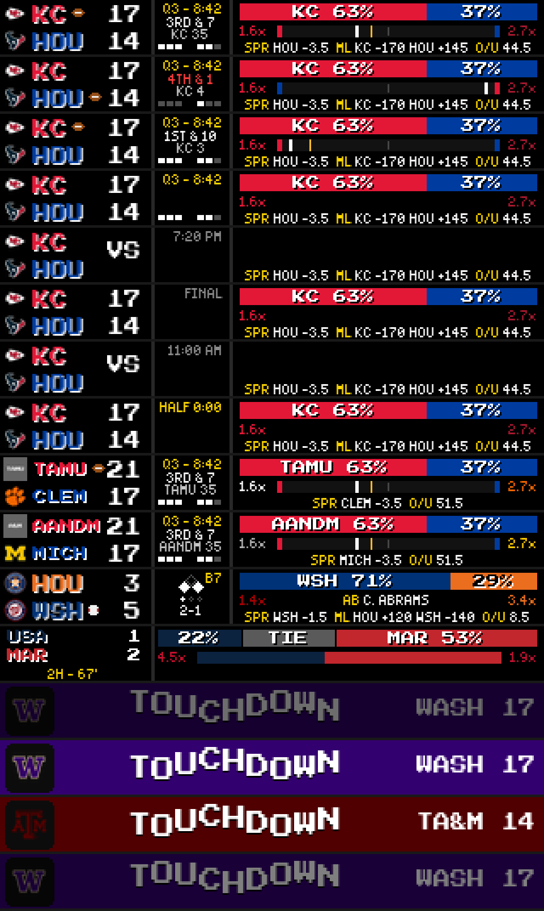
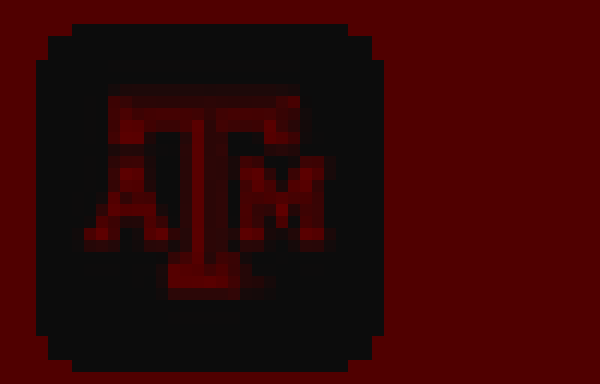

# Test Log — Touchdown celebration (2026-09-06)

**Branch:** `feature/soccer-worldcup-game-mode` (base `1904b0c7`)
**Spec:** `docs/superpowers/specs/2026-09-06-touchdown-celebration-design.md`
**Plan:** `docs/superpowers/plans/2026-09-06-touchdown-celebration.md`
**HEAD at verification:** `3ca85b54`

---

## Per-task status

| Task | Commit(s) | Subject | Status |
|------|-----------|---------|--------|
| 1 | `11f13ebb` + `012ba7cb` | pure touchdown frame renderer (`render_touchdown`, `TD_DURATION`) | ✅ VERIFIED (10/10 pass) |
| 2 | `98afa9e9` | `GameModeRenderer` routes to the celebration on `data["touchdown"]` | ✅ VERIFIED (5/5 pass) |
| 3 | `56b946f3` + `3ca85b54` | football plugin detects the score delta, owns the clock, caches its renderer | ✅ VERIFIED (24/24 pass) |
| 4 | this log | pixel proof + regression sweep | ✅ DONE |

Per the plan's ledger (`.superpowers/sdd/2026-09-06-touchdown-celebration/progress.md`), every
task passed a spec-compliance + task-quality review; Task 1 took one fix round (a
ripple-blind fade assertion that stayed green with the fade blend deleted entirely), Task 3
took one fix round (four review findings: uncovered `__init__` state, a byte-exact caching
guard defeated by a comment, missing in-flight/expiry behavioural coverage, and an unbounded
`_td_last_scores` dict). Task 2 was clean on first review.

---

## Step 1: New-test suites, run individually

```
EMULATOR=true python -m pytest test/game_mode/test_touchdown.py -p no:cacheprovider --override-ini="addopts=" -q
```
**Result: 10 passed in 0.49s**

```
EMULATOR=true python -m pytest test/game_mode/test_touchdown_routing.py -p no:cacheprovider --override-ini="addopts=" -q
```
**Result: 5 passed in 0.11s**

```
EMULATOR=true python -m pytest test/plugins/test_touchdown_trigger.py -p no:cacheprovider --override-ini="addopts=" -q
```
**Result: 24 passed in 1.16s**

10 + 5 + 24 = 39 new tests, matching the plan's estimate.

---

## Step 2: Full regression sweep

```
EMULATOR=true python -m pytest test/ -p no:cacheprovider --override-ini="addopts=" -q
```

**Result: 7 failed, 900 passed, 29 skipped, 22 errors in 39.97s**

This is an exact match — not just name-for-name, but count-for-count — to the number Task 3's
own ledger entry recorded at `3ca85b54` (`7F/900P/29S/22E`) and to the baseline this task's
brief asked me to confirm. Task 4 does not add or modify anything under `test/`, so an
unchanged full-suite result is the expected outcome, not a coincidence.

Failures vs. the branch's documented pre-existing set:

| Test | Status |
|---|---|
| `test/test_web_api.py::test_remote_route_contains_zones` | pre-existing ✅ |
| `test/test_web_api.py::TestDottedKeyNormalization::test_save_plugin_config_dotted_key_arrays` | pre-existing ✅ |
| `test/test_web_api.py::TestDottedKeyNormalization::test_save_plugin_config_none_array_gets_default` | pre-existing ✅ |
| `test/test_layout_manager.py::TestLayoutManager::test_save_layouts_error_handling` | pre-existing ✅ |
| `test/plugins/test_basketball_scoreboard.py::...::test_plugin_has_display_modes` | pre-existing ✅ |
| `test/plugins/test_visual_rendering.py::...::test_format_date_with_ordinal` | pre-existing ✅ (Windows `%-d` strftime) |
| `test/plugins/test_pga_game_mode.py::test_parse_golf_score_handles_all_espn_formats` | pre-existing ✅ (full-suite import-order artifact) |
| 22× `test/plugins/test_pga_game_mode.py::*` ERRORS | pre-existing ✅ (import collision; pass in isolation) |

Name-for-name identical to the set documented in the 2026-09-04 and 2026-06-30 test logs.
**No NEW failures. Branch is regression-clean.**

---

## Step 3: Pixel proof

Rendered with `scripts/dev/render_game_mode_frames.py` driving the real `GameModeRenderer`
in-process (the dev web UI cannot drive `game_focus` — its `plugin_manifests` are empty). 4×
upscale.

```
EMULATOR=true python scripts/dev/render_game_mode_frames.py docs/superpowers/test-logs/assets/2026-09-06-touchdown
```

**Logo check first:** both logos the scenes depend on exist —
`assets/sports/ncaa_logos/WASH.png` (11,145 bytes) and `assets/sports/ncaa_logos/TA&M.png`
(3,665 bytes). No substitution was needed.

### Full sheet



Rows 1-10 are the pre-existing football/baseball/soccer scenes (unchanged — `football()`,
`baseball()`, `soccer()` and the `SCENES` entries above the touchdown additions were not
touched, so there is no code path by which they could have changed). Rows 13-16 are the four
new touchdown scenes.

### Row-by-row on the touchdown frames

| row | frame | elapsed | what it shows |
|---|---|---|---|
| 13 | `touchdown_wash_start` | 0.15s | Panel floods Washington's `(51,0,111)` purple edge to edge. `TOUCHDOWN` and `WASH 17` are dim grey, not white — fade-in in progress (`_fade(0.15, 5.0) = min(1, 0.15/0.35, 4.85/0.5) ≈ 0.43`). The `W` logo sits on the dark `(12,12,12)` chip, clearly separated from the purple field even at reduced brightness. |
| 14 | `touchdown_wash_mid` | 1.30s | Full brightness (`_fade = 1.0`, elapsed is inside `[FADE_IN, duration-FADE_OUT]`). `TOUCHDOWN` is bright white with a black drop-shadow. The nine letters sit at visibly different heights — a rippling sine wave, not a flat baseline. `WASH 17` right-aligned in white. Logo chip reads as a distinct near-black rounded square against the purple field. |
| 15 | `touchdown_tamu_mid` | 1.30s | **The case the dark chip exists for.** Background is Texas A&M maroon `(80,0,0)`. The chip is unambiguously separated from the field — it reads as a near-black rounded square with sharp edges against the maroon, not as a blended blob. Zoomed crop (below) confirms the chip boundary is crisp at every pixel. `TOUCHDOWN`/`TA&M 14` render in the same bright white as row 14. |
| 16 | `touchdown_wash_end` | 4.75s | Dim again — fade-out (`_fade(4.75, 5.0) = min(1, 13.6, 0.25/0.5) = 0.5`), visibly darker than row 14 and close to (slightly brighter than) row 13's 0.43, which matches the math: the two ends of the window are not required to be identical brightness, just both dim relative to the mid frame. |

Zoomed crop of the TAMU chip (3x upscale of the already-4x sheet crop, so ~12x native pixels):



**Honest read on this frame, beyond the pass/fail check the brief asked for:** the chip does
its one job — separating the logo *area* from the maroon field — cleanly. What it does not do,
and was never claimed to do, is make the maroon "A&M" logo mark itself bright: the mark is a
dark maroon/near-black graphic on a `(12,12,12)` chip, so inside the chip's boundary the logo
is legible but low-contrast (you can read "A&M" but it is not a crisp white-on-black image).
The fix is "does this separate from the field," not "does every dark logo glow" — by that
standard it passes. On the real 4mm-pitch panel at a viewing distance, a low-contrast dark
mark on a near-black chip may read as "there's a logo there" more than "here's the Aggie
brand" — that is a real, un-fixed limitation worth flagging for anyone who cares about the
TAMU case specifically, not a regression from what Task 1 built.

### Normal scenes, unchanged

Spot-checked `football_live`, `football_redzone`, `baseball_live`, `soccer_live` in the sheet:
broadcast scorebug, extras panel, Kalshi bars and odds line all render exactly as they did in
the 2026-09-04 parity work, with no visual artifact from the `touchdown` key's presence in the
renderer (it is a `data.get("touchdown")` lookup with `isinstance(td, dict)` and `data.get("sport") == "football"` gates — every non-touchdown scene has no such key, so the new code path is
never entered for them, which is also what `test_no_touchdown_key_renders_the_normal_frame_byte_identically` in Task 2 asserts directly).

---

## What was NOT proven

- **The celebration has never fired from real ESPN data.** Every frame in this log — and
  every passing test in `test/plugins/test_touchdown_trigger.py` — is driven by either a
  synthetic score delta fed directly to the plugin's detector method, or a hand-built
  `touchdown` dict passed straight to `GameModeRenderer.render()`. No live NFL or NCAA
  football game has scored a touchdown while this code was watching it. **A live touchdown
  rendered on the Pi during a real game is the actual confirm** — the trigger's 6-8 point
  delta window, the "never fire on first observation" guard, and the PAT-ignore logic are only
  as good as the ESPN score-polling cadence in practice, and that cadence has not been
  observed against this code.
- **No emulator or hardware screenshot.** All pixel evidence in this log comes from
  `GameModeRenderer` in-process via `scripts/dev/render_game_mode_frames.py`, not from
  `GET /api/v3/display/current` on a running emulator or from the Pi's actual LED panels.
  On-glass appearance — brightness, color accuracy, and whether the ripple reads as motion
  rather than jitter at the real refresh rate — is unproven.
  Neither the emulator nor the Pi was running during this task; standing one up to capture
  `/api/v3/display/current` was out of scope for a pure frame-renderer proof and was not
  attempted.
- **The ripple's motion.** Every proof frame here is a single still. `RIPPLE_SPEED = 2.2 Hz`
  animating smoothly across ~625 frames at 125 FPS over the 5s window is asserted
  numerically by Task 1's tests (`test_frames_at_different_elapsed_times_differ`,
  `test_ripple_stays_inside_the_panel` swept over `range(0, 100)`) but never watched as
  motion, in the emulator or otherwise.
- **NFL specifically.** Both touchdown scenes here use an NCAA team (Washington) and a
  hand-picked NFL-shaped `football()` base; no NFL logo/color pair was used as the flooded
  background. The renderer treats them identically (it only reads `color`/`logo` off the
  dict), but that is inference from the code, not a rendered NFL frame.
- **Two touchdowns in one 10s ESPN poll window.** Flagged in Task 3's ledger as a known,
  physically-unreachable-in-real-football edge case for the delta trigger (0→3→6 via two
  field goals) — not re-tested here.
- **Renderer-caching's actual FPS impact.** Task 3 added the `_focus_renderer` cache because
  "the animation's smoothness depends on it," but no frame-rate measurement — synthetic or
  on-hardware — was taken before or after. The tests assert the caching *mechanism* (one
  construction call site, gated by a cache-miss guard), not a measured smoothness delta.

---

## Reproduction

```bash
# new-feature tests
EMULATOR=true python -m pytest test/game_mode/test_touchdown.py test/game_mode/test_touchdown_routing.py \
  test/plugins/test_touchdown_trigger.py -p no:cacheprovider --override-ini="addopts=" -q

# full regression sweep
EMULATOR=true python -m pytest test/ -p no:cacheprovider --override-ini="addopts=" -q

# pixel frames
EMULATOR=true python scripts/dev/render_game_mode_frames.py <out_dir>
```

## Deploy

Python-only (`src/game_mode/touchdown.py`, `src/game_mode/renderer.py`, the football plugin).
`git pull` then `sudo systemctl restart ledmatrix.service` — a hard restart, since
`/api/v3/display/restart` is a soft reload that will not pick up changed Python. This task
(4) touches no production code — only the dev frame-render script and this log — so it needs
no deploy step of its own; Tasks 1-3 are what ship.
